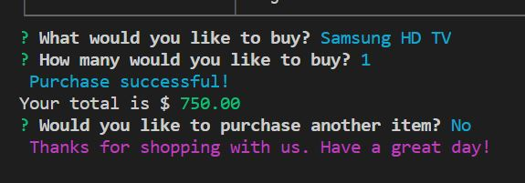

Objective: Create an Amazon-like storefront with MySQL skills. The app will take in orders from customers and deplete stock from the store's inventory. As a bonus task, you can program your app to track product sales across your store's departments and then provide a summary of the highest-grossing departments in the store.

Contributors: Adam Jacobs

History: SQL Errors: Auto_Increment needed to be removed from schema.sql and changed to IDENTITY(1, 1). Various other errors encoutered and troubleshooted through online research.

Hat tip to: Stackoverflow, various Youtube videos and numerous other online resources.

Functionality:

Customer View:

Manager View:

Supervisor View:

